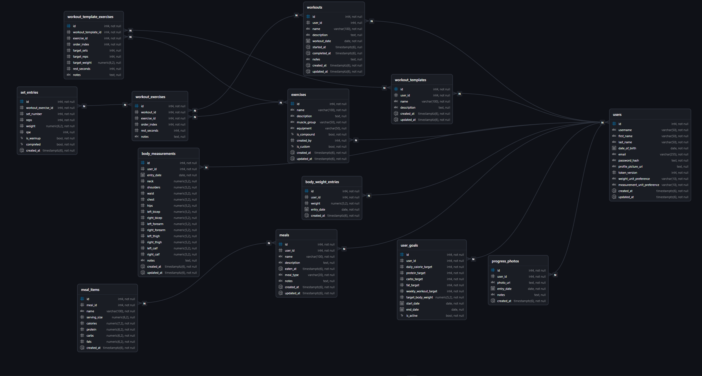

# Fitness Performance Tracker


A backend-first fitness tracking platform for managing users, goals, and custom exercise libraries, with the database groundwork already in place for workouts, nutrition, body measurements, and progress photos.

## Overview

This project is built with FastAPI and PostgreSQL and follows a layered architecture:

- `routers/` exposes HTTP endpoints
- `services/` contains business rules
- `repositories/` handles SQL and persistence
- `schemas/` defines request and response models

At the moment, the live API focuses on three slices:

- user registration, login, token refresh, profile management, avatar updates, and password changes
- user goal creation and lifecycle management
- custom exercise creation, browsing, updating, and deletion with visibility rules

The schema already includes upcoming domains such as workouts, workout templates, meals, body-weight entries, body measurements, and progress photos.

## Current Status

This repository is currently in an API-first phase.

- live and routed today: users, goals, exercises
- implemented in the schema and repository layer, but not yet exposed end-to-end: workouts, meals, body tracking, progress photos
- frontend and docs folders are present as placeholders for later slices

## Current Features

- JWT-based authentication with access and refresh tokens
- OAuth2-compatible `/users/token` endpoint for Swagger UI and password-flow clients
- Profile endpoints for reading and updating the authenticated user
- Password change flow with token revocation support
- Avatar set and clear support
- Goal tracking with activation and deactivation flows
- Exercise visibility rules for built-in and user-created exercises
- Postman collection for happy-path and negative API smoke tests

## Tech Stack

- Python 3.13
- FastAPI
- Pydantic v2
- PostgreSQL
- `psycopg`
- `python-jose`
- `passlib[bcrypt]`
- `python-dotenv`

## Project Structure

```text
Fitness-Performance-Tracker/
|-- auth/               # hashing + JWT helpers
|-- core/               # configuration loading
|-- data/               # SQL schema and DB executor helpers
|-- dependencies/       # FastAPI dependency providers and auth deps
|-- postman/            # API collection for manual testing
|-- repositories/       # SQL repositories per domain
|-- routers/            # FastAPI route modules
|-- schemas/            # Pydantic request/response models
|-- services/           # business logic layer
|-- utils/              # validators and app errors
`-- main.py             # FastAPI application entrypoint
```

## Architecture

The API follows a layered flow:

```text
HTTP Request
  -> Router
  -> Service
  -> Repository
  -> PostgreSQL
```

Each layer has a focused responsibility:

- routers translate HTTP into application calls
- services enforce business rules and ownership checks
- repositories execute SQL and map database rows into schemas
- schemas validate request and response payloads

## Database Model

The database schema in `data/schema.sql` currently defines tables for:

- users
- user goals
- exercises
- workouts
- workout exercises
- set entries
- workout templates
- workout template exercises
- meals
- meal items
- body weight entries
- body measurements
- progress photos

The application routes currently expose only the `users`, `goals`, and `exercises` slices, but the rest of the schema is already prepared for future API layers.

## Getting Started

### Prerequisites

- Python 3.13+
- PostgreSQL
- `pip`

### 1. Clone the repository

```bash
git clone <your-repository-url>
cd Fitness-Performance-Tracker
```

### 2. Create and activate a virtual environment

```bash
python -m venv .venv
```

Windows PowerShell:

```powershell
.venv\Scripts\Activate.ps1
```

macOS / Linux:

```bash
source .venv/bin/activate
```

### 3. Install dependencies

```bash
pip install -r requirements.txt
```

### 4. Create the PostgreSQL database

Example:

```sql
CREATE DATABASE fitness_performance_tracker;
```

### 5. Apply the schema

```bash
psql -U postgres -d fitness_performance_tracker -f data/schema.sql
```

### 6. Configure environment variables

Create a `.env` file in the project root and set the values below:

```env
DB_HOST=localhost
DB_PORT=5432
DB_NAME=fitness_performance_tracker
DB_USER=postgres
DB_PASSWORD=your_password_here

JWT_SECRET_KEY=replace_with_a_long_random_secret
JWT_ALGORITHM=HS256
ACCESS_TOKEN_EXPIRE_MINUTES=15
REFRESH_TOKEN_EXPIRE_DAYS=7
```

Note: the application currently reads `ACCESS_TOKEN_EXPIRE_MINUTES` and `REFRESH_TOKEN_EXPIRE_DAYS` from code, so those are the names you should use in `.env`.

### 7. Run the API

```bash
uvicorn main:app --reload
```

Open:

- Swagger UI: `http://127.0.0.1:8000/docs`
- ReDoc: `http://127.0.0.1:8000/redoc`
- Health/root endpoint: `http://127.0.0.1:8000/`

## API Surface

### Users

- `POST /users/register`
- `POST /users/login`
- `POST /users/token`
- `POST /users/refresh`
- `GET /users/me`
- `PATCH /users/me`
- `PATCH /users/me/avatar`
- `POST /users/me/change-password`
- `DELETE /users/me`

### Goals

- `POST /goals/`
- `GET /goals/current`
- `GET /goals/history`
- `GET /goals/{goal_id}`
- `PATCH /goals/{goal_id}`
- `POST /goals/{goal_id}/activate`
- `POST /goals/{goal_id}/deactivate`

### Exercises

- `POST /exercises/`
- `GET /exercises/`
- `GET /exercises/{exercise_id}`
- `PATCH /exercises/{exercise_id}`
- `DELETE /exercises/{exercise_id}`

## Manual Testing

A Postman collection is included at `postman/Fitness-Performance-Tracker.postman_collection.json`.

It is organized by slice and split into:

- happy path requests
- negative cases
- cleanup where needed

The collection is designed to be rerunnable:

- users are registered with randomized usernames and emails
- exercises are created with randomized names
- password changes are reverted at the end of the user flow

## Database Diagram

The schema is defined in `data/schema.sql`, and the current ERD is included below.

Suggested diagram scope:

- users
- user goals
- exercises
- workouts
- workout exercises
- set entries
- meals
- meal items
- body weight entries
- body measurements
- progress photos



## Development Notes

- The app currently exposes API routes only. `frontend/` and `docs/` are present but not yet populated.
- Automated tests are not implemented yet; current verification is mainly through manual API testing and the Postman collection.
- Ruff configuration is defined in `pyproject.toml`.
- The current README is intentionally scoped to the backend that is available now, rather than promising unfinished slices as if they were already live.

## Roadmap

- add service and router layers for workouts
- add nutrition endpoints for meals and meal items
- expose body-weight, measurement, and progress-photo tracking
- add automated tests
- add seeding/dev fixtures for built-in exercises
- expand documentation and diagrams

## Inspiration

The README structure was inspired by these templates:

- [Louis3797 / awesome-readme-template](https://github.com/Louis3797/awesome-readme-template)
- [othneildrew / Best-README-Template](https://github.com/othneildrew/Best-README-Template)
