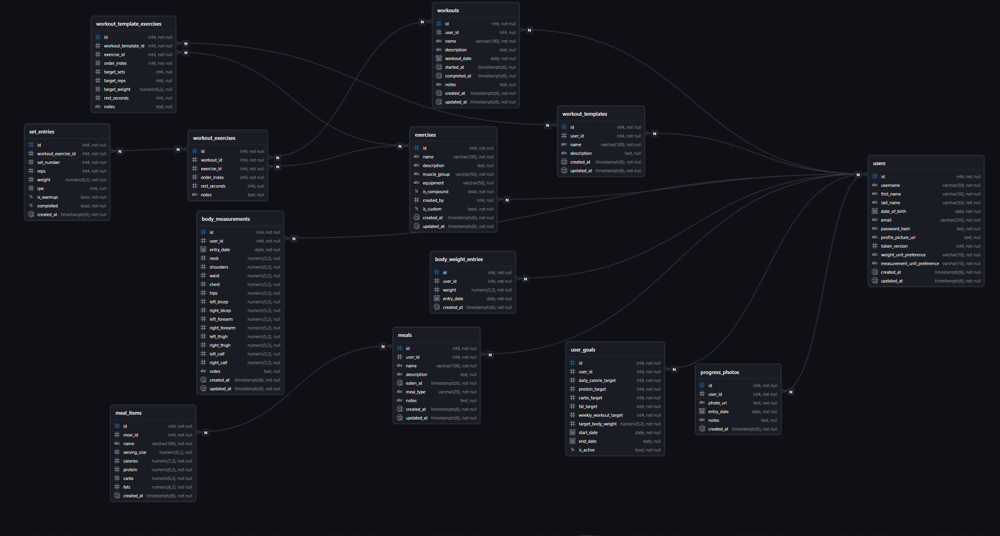

# Fitness Performance Tracker


A FastAPI and PostgreSQL backend for tracking fitness progress across users, goals, exercises, workouts, and workout exercises.

## Overview

The project follows a layered architecture:

- `routers/` exposes HTTP endpoints
- `services/` applies business rules and ownership checks
- `repositories/` handles SQL and persistence
- `schemas/` defines request and response contracts

The live API currently covers:

- authentication and user profile management
- goal creation and lifecycle updates
- exercise library management with visibility rules
- workout logging, listing, updating, and deletion
- workout exercise management inside user-owned workouts

The database schema is already prepared for future nutrition and body-tracking slices such as meals, body-weight entries, measurements, and progress photos.

## Current Status

This repository is in an API-first backend phase.

- live and routed today: users, goals, exercises, workouts, workout exercises
- implemented in the schema and repository layer, but not yet exposed end-to-end: meals, meal items, body-weight entries, body measurements, progress photos, set entries, workout templates
- `frontend/` is still a placeholder for later work

## Current Features

- JWT-based authentication with access and refresh tokens
- OAuth2-compatible `POST /users/token` endpoint for Swagger UI and password-flow clients
- authenticated profile read, update, avatar, password-change, and account-deletion flows
- goal creation, history lookup, activation, and deactivation
- exercise CRUD with filtering and built-in vs custom visibility handling
- workout CRUD with pagination, free-text search, and date-range filters
- nested workout exercise CRUD inside workouts with transactional order-index reordering
- database bootstrap script in `data/init_db.py`
- rerunnable Postman collection for users, goals, exercises, workouts, and workout exercises

## Tech Stack

- Python 3.13+
- FastAPI
- Pydantic v2
- PostgreSQL
- `psycopg`
- `python-jose`
- `passlib[bcrypt]`
- `python-dotenv`
- Ruff

## Project Structure

```text
Fitness-Performance-Tracker/
|-- auth/               # password hashing and JWT helpers
|-- core/               # configuration and app-level errors
|-- data/               # DB helpers, SQL query registry, schema and seed scripts
|   |-- mappers/        # Database row types, validation and model conversion
|   `-- sql/            # SQL files grouped by entity and operation
|-- dependencies/       # FastAPI dependency providers and auth deps
|-- docs/               # docs assets such as the ERD image
|-- ports/              # Repository and unit-of-work contracts
|-- postman/            # manual API testing collection
|-- repositories/       # SQL repositories per domain
|-- routers/            # API route modules
|-- schemas/            # Pydantic request and response models
|-- services/           # business logic layer
|-- tests/              # service, authentication, schema, HTTP and repository tests
|-- utils/              # environment and validation helpers
`-- main.py             # FastAPI application entrypoint
```

## Architecture

```text
HTTP Request
  -> Router
  -> Service
  -> Repository
  -> PostgreSQL
```

Each layer has a focused responsibility:

- routers translate HTTP requests into application calls
- services enforce rules such as ownership, visibility, and validation
- repositories execute SQL and return mapped domain data
- schemas validate request and response payloads

Services depend on the repository `Protocol` interfaces in `ports/repositories/`.
These contracts cover the operations currently needed for users, goals, exercises,
workouts, workout exercises, and meals. `dependencies/providers.py` supplies the
concrete PostgreSQL repositories and declares their protocol return types so type
checking verifies compatibility. The authentication dependency also uses the user
repository protocol.

Implementations satisfy protocols structurally: they need matching method names,
parameters, and return types, without inheriting from the protocol or a concrete
repository. This lets service tests use small typed fakes, as shown in
`tests/test_repository_protocols.py`. Extend the relevant contract when a service
needs a new operation; SQL and row-mapping details remain in the implementations.

`ports/unit_of_work.py` defines an explicit transaction boundary, implemented by
`data/unit_of_work.py`. Goal creation, updates, activation, and deactivation open
one connection and use `UserGoalsUnitOfWorkRepository` for every read and write.
`UserGoalsRepository` calls an injected `QueryExecutor` directly: the default is
the standalone executor module, while `TransactionExecutor` binds the same
operations to the unit of work's cursor. Both paths reuse the goal queries and mapping.
The service calls `commit()` after ownership checks, date validation, writes, and
result mapping succeed. Leaving without a successful commit rolls back the work,
so a failed replacement goal cannot leave the previous goal deactivated. Reads
such as goal history continue to use the ordinary repository.

Each goal transaction first locks the owner's user row with `FOR UPDATE`, including
when the user has no goals yet. This serializes concurrent goal writes for the same
user through these service operations. A user deleted before the lock is acquired
produces `UserNotFoundError`. Repositories inside the unit of work never commit
independently. To extend the boundary to another entity, add its transaction-bound
repository and port to the unit of work, reusing the existing SQL and mapper.
Unit tests cover explicit commits, rollback paths, driver errors, and resource
cleanup; PostgreSQL locking and concurrent requests still require integration tests.

`core/exception_handlers.py` owns the exception-to-HTTP mappings, registered by
`main.py`. Routers and authentication dependencies raise typed application errors;
the handlers produce `{"detail": ...}` responses and add `WWW-Authenticate: Bearer`
for authentication failures. Add new error mappings here instead of repeating
`HTTPException` conversion blocks in routes. FastAPI continues to handle
request validation and framework HTTP errors, including their response headers.

`utils/pagination.py` defines the shared pagination defaults and bounds.
`dependencies/pagination.py` validates `limit` and `offset` for the exercise, meal,
workout, and goal-history list routes. Defaults remain `limit=100` and `offset=0`;
the API accepts limits from 1 to 1000 and nonnegative offsets, returning HTTP 422
for invalid values. Repositories use the same normalization helper to clamp values
from direct callers. Services and repository protocols share the defaults, and list
responses remain arrays.

Server failures are logged with exception information. Database, repository, and
row-validation failures return a generic database error; unexpected failures return
an internal-server-error message. User creation also uses a fixed public message
so wrapped repository details are not exposed. A deleted user during token refresh
raises `InvalidRefreshTokenError` (401); missing users in profile operations raise
`UserNotFoundError` (404).

Repository queries live in `data/sql/<entity>/<operation>.sql`, following the
FleetFlow layout. `data/loader.py` reads files relative to its own location and
caches their contents. `data/queries.py` exposes typed, lazily loaded groups;
repositories use references such as `QUERIES.users.get_by_id`.

Database row types and conversion functions live in `data/mappers/<entity>.py`.
Repositories pass fetched rows to functions such as `map_user(row)`; mappers
validate column types, normalize numeric values and construct the Pydantic model.
`data/validation.py` provides a shared `RowValidator` for integer, string, boolean,
date, datetime, numeric, and nullable values. Each mapper binds its own row error
class so existing exception types and field messages are preserved. Type checks
retain the existing mapper rules; Pydantic applies value constraints afterward.
Numeric normalization stays in the mapper where conversion policies differ, with
a shared nullable Decimal conversion for body measurements.
Keep entity-specific row mapping in these modules when adding fields or entities,
and reuse the validation helpers for column checks. Mappers and helpers can be
tested directly without a database connection.

To add a query, create its SQL file and register it in the corresponding query
dataclass and `QueryRegistry` property. Optional predicates live in `filter_*.sql`
files and fill a statement's `{filters}` slot. Partial updates fill `{set_clause}`
using the repository's existing column whitelist. Both slots are for SQL structure
only: pass all runtime values separately through the executor's `%s` parameters.
SQL files must be included when copying or deploying the backend. Queries are
cached for the life of the process, so restart the backend after editing them.

Run the database-independent tests with:

```bash
python -m unittest discover -s tests -v
```

The suite covers successful operations and failure paths across all six services:
registration, login, password retries, token revocation, ownership checks, goal
activation and partial date updates, exercise name conflicts, workout ordering,
and failed repository writes. Service tests use autospecced repository protocols;
the meal protocol tests also exercise a complete flow with an in-memory repository.

Additional tests cover real password hashing and JWT signing/validation, request
schema boundaries for all eleven entities, shared validators, HTTP error responses,
SQL loading and parameter binding, and database row mapping. No running database or
application server is required. Repository tests mock database execution, so PostgreSQL
constraints, concurrent requests, and transaction isolation still need integration tests.

To measure statement and branch coverage, install the optional `coverage` development
tool in your virtual environment and run:

```bash
python -m coverage run --branch --source=services,auth,schemas,utils.validators -m unittest discover -s tests
python -m coverage report -m
```

This report measures those modules only. Full branch coverage helps find untested
paths; it does not prove that every possible input or database interaction is correct.

## Database Model

The schema in `data/schema.sql` defines tables for:

- users
- user goals
- exercises
- workouts
- workout exercises
- set entries
- workout templates
- workout template exercises
- meals
- meal items
- body weight entries
- body measurements
- progress photos

The current API exposes the users, goals, exercises, workouts, and workout exercises slices, but the rest of the schema is already in place for future routes and services.

## Getting Started

### Prerequisites

- Python 3.13+
- PostgreSQL
- `pip`

### 1. Clone the repository

```bash
git clone <your-repository-url>
cd Fitness-Performance-Tracker
```

### 2. Create and activate a virtual environment

```bash
python -m venv .venv
```

Windows PowerShell:

```powershell
.venv\Scripts\Activate.ps1
```

macOS / Linux:

```bash
source .venv/bin/activate
```

### 3. Install dependencies

```bash
pip install -r requirements.txt
```

### 4. Create the PostgreSQL database

Example:

```sql
CREATE DATABASE fitness_performance_tracker;
```

### 5. Configure environment variables

Use `.env.example` as a starting point and create a `.env` file in the project root:

```env
DB_HOST=localhost
DB_PORT=5432
DB_NAME=fitness_performance_tracker
DB_USER=postgres
DB_PASSWORD=your_password_here

LOG_LEVEL=INFO
# LOG_FILE=logs/fitness-performance-tracker.log
JWT_SECRET_KEY=replace_with_a_long_random_secret
JWT_ALGORITHM=HS256
ACCESS_TOKEN_EXPIRE_MINUTES=30
REFRESH_TOKEN_EXPIRE_DAYS=7
```

### 6. Initialize the database schema

Run the bootstrap script:

```bash
python -m data.init_db
```

Useful options:

- `python -m data.init_db --no-reset` keeps the existing `public` schema and reapplies `schema.sql`
- `python -m data.init_db --no-seed` skips `seed.sql`

If you prefer, you can still apply the schema manually with `psql`.

### 7. Run the API

```bash
uvicorn main:app --reload
```

Logging is configured by `core/logging_config.py` during API startup and when
running the database bootstrap CLI. Logs go to stdout with timestamps, levels,
and logger names. `LOG_LEVEL` defaults to `INFO` and accepts `DEBUG`, `INFO`,
`WARNING`, `ERROR`, `CRITICAL`, or `NOTSET` (case-insensitive). An unsupported
value stops startup with a configuration error.

Set `LOG_FILE` to also write UTF-8 logs to a rotating file. Parent directories
are created automatically; files rotate at 10 MiB with five backups. Relative
paths resolve from the process working directory. Uvicorn error and access
logs use the shared handlers after application startup. Repeated configuration
replaces the handlers instead of adding duplicate output, and Uvicorn's
`--no-access-log` setting is respected. SQL debug messages
include parameter counts rather than parameter values.

Open:

- Swagger UI: `http://127.0.0.1:8000/docs`
- ReDoc: `http://127.0.0.1:8000/redoc`
- Root endpoint: `http://127.0.0.1:8000/`

## API Surface

### Public Endpoints

- `GET /`
- `POST /users/register`
- `POST /users/login`
- `POST /users/token`
- `POST /users/refresh`

### Authenticated User Endpoints

- `GET /users/me`
- `PATCH /users/me`
- `PATCH /users/me/avatar`
- `POST /users/me/change-password`
- `DELETE /users/me`

### Goal Endpoints

- `POST /goals/`
- `GET /goals/current`
- `GET /goals/history`
- `GET /goals/{goal_id}`
- `PATCH /goals/{goal_id}`
- `POST /goals/{goal_id}/activate`
- `POST /goals/{goal_id}/deactivate`

### Exercise Endpoints

- `POST /exercises/`
- `GET /exercises/`
- `GET /exercises/{exercise_id}`
- `PATCH /exercises/{exercise_id}`
- `DELETE /exercises/{exercise_id}`

`GET /exercises/` supports:

- `limit`
- `offset`
- `search`
- `muscle_group`
- `equipment`
- `is_compound`
- `is_custom`

### Workout Endpoints

- `POST /workouts/`
- `GET /workouts/`
- `GET /workouts/{workout_id}`
- `PATCH /workouts/{workout_id}`
- `DELETE /workouts/{workout_id}`

`GET /workouts/` supports:

- `search`
- `limit`
- `offset`
- `date_from`
- `date_to`

### Workout Exercise Endpoints

- `POST /workouts/{workout_id}/exercises/`
- `GET /workouts/{workout_id}/exercises/`
- `GET /workouts/{workout_id}/exercises/{workout_exercise_id}`
- `PATCH /workouts/{workout_id}/exercises/{workout_exercise_id}`
- `DELETE /workouts/{workout_id}/exercises/{workout_exercise_id}`

## Manual Testing

A Postman collection is included at `postman/Fitness-Performance-Tracker.postman_collection.json`.

It currently covers:

- health check
- users
- goals
- exercises
- workouts
- workout exercises

The collection is designed to be rerunnable:

- users are registered with randomized usernames and emails
- exercises are created with randomized names
- password changes are reverted at the end of the user flow
- workout exercise flows reuse the created workout and exercise IDs within the same run

## Database Diagram

The schema is defined in `data/schema.sql`, and the current ERD is included below.



## Development Notes

- The app currently exposes API routes only.
- Automated tests run with `python -m unittest discover -s tests -v`; Swagger UI and Postman support manual API verification.
- Ruff configuration is defined in `pyproject.toml`.
- `data/init_db.py` is the quickest way to reset and rebuild the database during local development.

## Roadmap

- add set-entry API layers
- add nutrition endpoints for meals and meal items
- expose body-weight, measurement, and progress-photo tracking
- add PostgreSQL integration tests for constraints, transactions, and concurrent writes
- expand the Postman collection to cover the remaining slices
- expand documentation and diagrams

## Inspiration

The README structure was inspired by these templates:

- [Louis3797 / awesome-readme-template](https://github.com/Louis3797/awesome-readme-template)
- [othneildrew / Best-README-Template](https://github.com/othneildrew/Best-README-Template)
